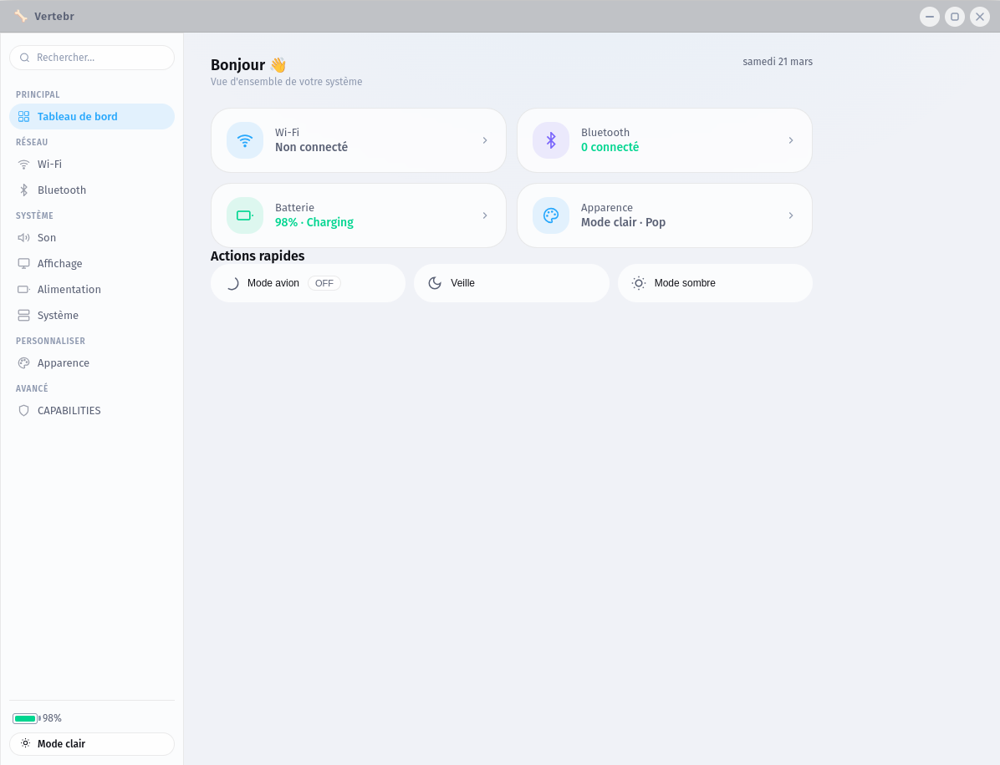

<div align="center">
  
  <h1>🦴 Vertebr</h1>
  <p><strong>Panneau de configuration système moderne pour Pop!_OS et Linux</strong><br/>
  Style HarmonyOS · Architecture Modulaire · Rust + Vue.js 3</p>
  
  [](LICENSE)
  [](https://www.rust-lang.org)
  [](https://vuejs.org)
  [](https://www.electronjs.org)
  [](https://pop.system76.com)
  [](CONTRIBUTING.md)
  
  <p>
    <a href="#-architecture">Architecture</a> •
    <a href="#-installation-rapide">Installation</a> •
    <a href="#-ajouter-un-module">Ajouter un module</a> •
    <a href="#-modules-disponibles">Modules</a> •
    <a href="#-développement">Développement</a>
  </p>
</div>

---

## 📸 Aperçu

<div align="center">
  
  <br/>
  <em>Interface principale de Vertebr - Style HarmonyOS avec glassmorphism</em>
</div>

---

## 🎯 Vision

**Vertebr** réinvente le panneau de configuration Linux en combinant :

- ✨ **Une interface moderne** inspirée de HarmonyOS (glassmorphism, animations fluides)
- 🏗️ **Une architecture robuste** inspirée de Spring Boot (7 couches, modularité maximale)
- 🔒 **Une sécurité granulaire** avec CAPABILITIES Linux et séparation des privilèges
- 🚀 **Des performances exceptionnelles** grâce à Rust et au socket UNIX

> *"Vertebr constitue la structure centrale qui relie l'interface utilisateur aux composants profonds du système Linux."*

---

## 🏗️ Architecture

```
Vertebr
├── daemon/               # Backend Rust (daemon système root)
│   └── src/
│       ├── main.rs       # Point d'entrée
│       ├── server/       # Serveur UNIX Socket (Tokio async)
│       ├── router/       # Routeur central (HashMap + libloading)
│       ├── loader/       # Chargeur de modules .so
│       └── permissions/  # Gestion user/sudo/caps
│
├── modules/              # Modules dynamiques (.so) — Architecture Spring Boot
│   ├── wifi_module/      # Wi-Fi (nmcli)
│   ├── bluetooth_module/ # Bluetooth (bluetoothctl)
│   ├── audio_module/     # Audio (pactl)
│   ├── display_module/   # Affichage (xrandr)
│   ├── power_module/     # Alimentation (upower, systemctl)
│   ├── theme_module/     # Thème GNOME (gsettings)
│   └── caps_module/      # CAPABILITIES Linux (setcap/getcap)
│
├── config/
│   └── routes.toml       # Configuration centrale des routes
│
├── systemd/
│   └── vertebr.service   # Unit file systemd
│
└── frontend/             # Interface Vue.js 3 + Electron
    └── src/
        ├── views/        # Pages (Wi-Fi, Bluetooth, Audio...)
        ├── stores/       # État global (Pinia)
        ├── services/     # Communication daemon
        ├── components/   # Composants UI HarmonyOS
        └── assets/       # CSS système de design
```

### Architecture d'un module (7 couches inspirées de Spring Boot)

```
module/
├── lib.rs          # Point d'entrée + exports C
├── controller.rs   # Gestion des requêtes (parsing JSON)
├── service.rs      # Logique métier
├── repository.rs   # Accès système (nmcli, bluetoothctl...)
├── mapper.rs       # Conversion Entity ↔ DTO
├── entity.rs       # Modèle interne
├── dto.rs          # Modèle API
└── config.rs       # Configuration
```

### Flux de données

```
[Utilisateur] → [Vue.js] → [Service] → [Socket UNIX] 
     ↓
[Daemon Rust] → [Routeur] → [Permission Check] 
     ↓
[Module .so] → [Controller] → [Service] → [Repository] 
     ↓
[Commande Linux] → [nmcli/bluetoothctl/pactl] 
     ↓
[Matériel] → [Réponse JSON] → [Mise à jour UI]
```

---

## 🚀 Installation rapide

### Prérequis

```bash
# Rust
curl --proto '=https' --tlsv1.2 -sSf https://sh.rustup.rs | sh

# Node.js et npm
sudo apt install nodejs npm

# Dépendances système
sudo apt install \
    build-essential \
    libssl-dev \
    pkg-config \
    libdbus-1-dev \
    network-manager \
    bluetooth \
    bluez \
    pulseaudio-utils \
    xrandr \
    upower
```

### Installation depuis les sources

```bash
# 1. Cloner le dépôt
git clone https://github.com/dev-houssam/vertebr
cd vertebr

# 2. Lancer l'installation automatique
sudo ./install.sh

# 3. Démarrer Vertebr
vertebr
```

### Installation manuelle

```bash
# Compiler le daemon
cd daemon
cargo build --release
sudo cp target/release/vertebr-daemon /usr/bin/

# Installer le service systemd
sudo cp systemd/vertebr.service /etc/systemd/system/
sudo systemctl daemon-reload
sudo systemctl enable vertebr
sudo systemctl start vertebr

# Compiler le frontend
cd ../frontend
npm install
npm run build

# Lancer l'application
npm run electron:start
```

---

## ➕ Ajouter un module

### Méthode 1 : Générateur automatique

```bash
# Lancer le générateur interactif
./scripts/generate_module.sh

# Suivre les instructions
? Nom du module: printer
? Description: Gestion des imprimantes
? Permission: user
? Routes: list, add, remove, set_default

# Résultat : printer_module.zip (backend + frontend)
```

### Méthode 2 : Création manuelle

1. **Créer la structure du module**
   ```bash
   mkdir -p modules/mon_module/src
   ```

2. **Implémenter les 7 couches** (voir template dans `docs/template/`)

3. **Compiler le module**
   ```bash
   cd modules/mon_module
   cargo build --release
   sudo cp target/release/libmon_module.so /usr/lib/vertebr/modules/
   ```

4. **Ajouter les routes dans `/etc/vertebr/routes.toml`**
   ```toml
   [[route]]
   path       = "mon:action"
   module     = "libmon_module.so"
   handler    = "ma_fonction"
   permission = "user"
   ```

5. **Redémarrer le daemon**
   ```bash
   sudo systemctl restart vertebr
   ```

### Structure d'une route

```toml
[[route]]
path = "wifi:list"           # Identifiant unique
module = "wifi_module.so"    # Fichier .so
handler = "list_handler"     # Fonction C exportée
permission = "user"          # user | sudo | caps
required_caps = ["CAP_NET_ADMIN"]  # Optionnel (uniquement pour caps)
```

---

## 📦 Modules disponibles

| Module | Routes | Commandes système | Permission |
|--------|--------|-------------------|------------|
| **wifi_module** | `wifi:list`, `wifi:connect`, `wifi:disconnect`, `wifi:status`, `wifi:enabled`, `wifi:airplane`, `wifi:forget` | `nmcli` | user |
| **bluetooth_module** | `bluetooth:status`, `bluetooth:list`, `bluetooth:power`, `bluetooth:connect`, `bluetooth:pair`, `bluetooth:remove` | `bluetoothctl` | user |
| **audio_module** | `audio:sinks`, `audio:sources`, `audio:volume`, `audio:mute`, `audio:default` | `pactl` | user |
| **display_module** | `display:list`, `display:mode`, `display:resolution`, `display:rotation`, `display:brightness` | `xrandr` | user |
| **power_module** | `power:status`, `power:profile`, `power:reboot`, `power:shutdown`, `power:suspend`, `power:hibernate` | `systemctl`, `upower` | sudo |
| **theme_module** | `theme:get`, `theme:set`, `theme:list`, `theme:accent` | `gsettings`, `dconf` | user |
| **caps_module** | `caps:list`, `caps:get`, `caps:grant`, `caps:revoke` | `setcap`, `getcap` | caps |

---

## 🛠️ Développement

### Compiler le projet complet

```bash
# Backend
cd daemon
cargo build --release

# Frontend
cd ../frontend
npm install
npm run build
```

### Tester un module

```bash
# Vérifier les logs du daemon
sudo journalctl -u vertebr -f

# Tester via le socket UNIX
echo '{"route":"wifi:list","payload":{}}' | nc -U /tmp/vertebr.sock | jq .
```

### Déboguer

```bash
# Activer les logs détaillés
sudo sed -i 's/log_level = "info"/log_level = "debug"/' /etc/vertebr/config.toml
sudo systemctl restart vertebr

# Vérifier les modules chargés
sudo journalctl -u vertebr | grep "routes chargées"
```

### Structure des tests

```bash
# Tests unitaires backend
cd daemon
cargo test

# Tests frontend
cd frontend
npm run test:unit

# Tests d'intégration
npm run test:e2e
```

---

## 🔒 Sécurité

### Modèle de permissions

| Niveau | Description | Exemples |
|--------|-------------|----------|
| **user** | Tout utilisateur connecté | Wi-Fi scan, lecture thème |
| **sudo** | Processus root ou membre sudo | Redémarrage, reset réseau |
| **caps** | CAPABILITIES spécifiques | Configuration réseau avancée |

### CAPABILITIES Linux

```bash
# Visualiser les CAPABILITIES d'un binaire
vertebr caps:list --binary /usr/bin/ping

# Ajouter CAP_NET_ADMIN
vertebr caps:grant --binary /usr/bin/my_tool --caps CAP_NET_ADMIN
```

### Communication sécurisée

- Socket UNIX `/tmp/vertebr.sock` (permissions 0660)
- Groupe dédié `vertebr-users`
- Vérification UID via `SO_PEERCRED`
- Isolation des modules (crash d'un module n'affecte pas le daemon)

---

## 📚 Documentation

| Documentation | Description |
|---------------|-------------|
| [Architecture](docs/ARCHITECTURE.md) | Architecture technique détaillée |
| [API Reference](docs/API.md) | Documentation de l'API JSON |
| [Modules Guide](docs/MODULES.md) | Création de modules pas à pas |
| [Security](docs/SECURITY.md) | Modèle de sécurité et CAPABILITIES |
| [Contributing](CONTRIBUTING.md) | Comment contribuer au projet |

---

## 🤝 Contribution

Les contributions sont les bienvenues !

1. **Fork** le projet
2. **Créez votre branche** (`git checkout -b feature/amazing-feature`)
3. **Commitez vos changements** (`git commit -m 'Add amazing feature'`)
4. **Poussez** (`git push origin feature/amazing-feature`)
5. **Ouvrez une Pull Request**

### Directives de contribution

- Suivez le style de code Rust (`rustfmt`) et Vue.js (Prettier)
- Ajoutez des tests pour les nouvelles fonctionnalités
- Mettez à jour la documentation
- Respectez le code de conduite

---

## 📊 Feuille de route

### ✅ Version 1.0.0 (Mars 2026)
- Architecture Rust + Vue.js complète
- 7 modules fonctionnels (Wi-Fi, Bluetooth, Audio, Display, Power, Theme, CAPABILITIES)
- Thème HarmonyOS dynamique
- Générateur de modules interactif

### 🚧 Version 1.1.0 (Prévu Q2 2026)
- [ ] Module imprimantes (CUPS)
- [ ] Module scanners (SANE)
- [ ] Dashboard temps réel
- [ ] Profils de configuration
- [ ] Support Wayland complet

### 🔮 Version 2.0.0 (Prévu Q4 2026)
- [ ] Store de modules
- [ ] Application mobile companion
- [ ] Interface tactile
- [ ] Support multi-distribution (Ubuntu, Debian, Fedora)

---

## 📄 Licence

Vertebr est distribué sous licence **MIT**.

```text
MIT License

Copyright (c) 2026 Houssam

Permission is hereby granted, free of charge, to any person obtaining a copy
of this software and associated documentation files (the "Software"), to deal
in the Software without restriction, including without limitation the rights
to use, copy, modify, merge, publish, distribute, sublicense, and/or sell
copies of the Software, and to permit persons to whom the Software is
furnished to do so, subject to the following conditions:

The above copyright notice and this permission notice shall be included in all
copies or substantial portions of the Software.
```

---

## 👥 Équipe

- **Houssam BACAR** - *Architecte principal* - [GitHub](https://github.com/dev-houssam)

---

## 🙏 Remerciements

- [System76](https://system76.com) pour Pop!_OS et l'inspiration
- [Rust Community](https://www.rust-lang.org) pour l'écosystème Rust
- [Vue.js Team](https://vuejs.org) pour le framework Vue.js
- [Electron Team](https://www.electronjs.org) pour Electron

---

<div align="center">
  <sub>Construit avec ❤️ pour la communauté Linux</sub>
  <br/>
  <sub>⭐ Starrezzz le projet si vous l'aimez ! ⭐</sub>
</div>
